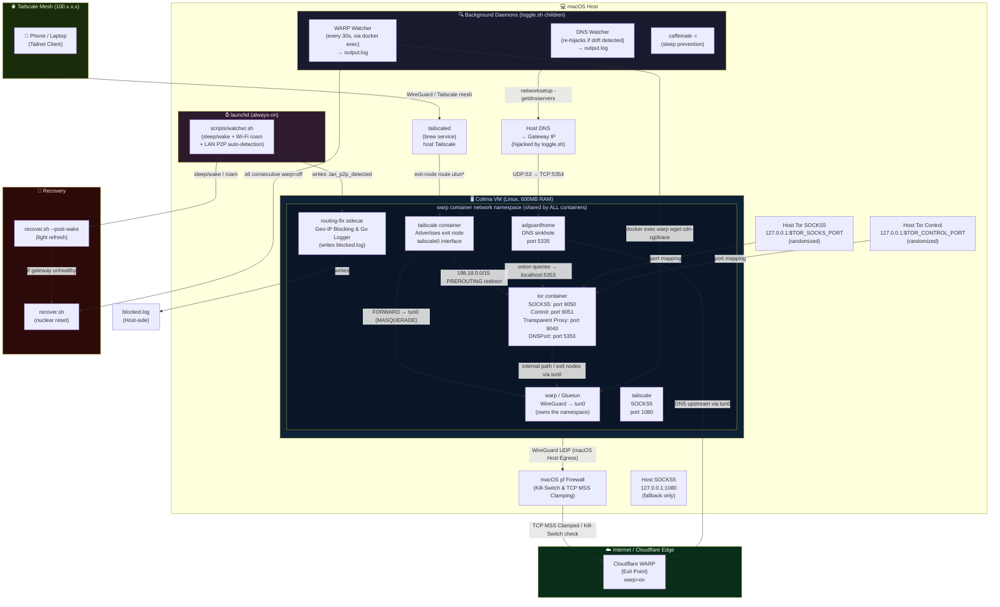
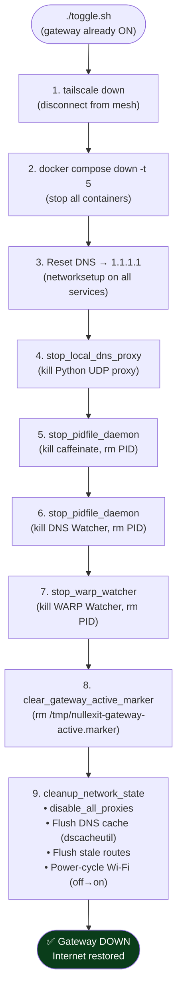
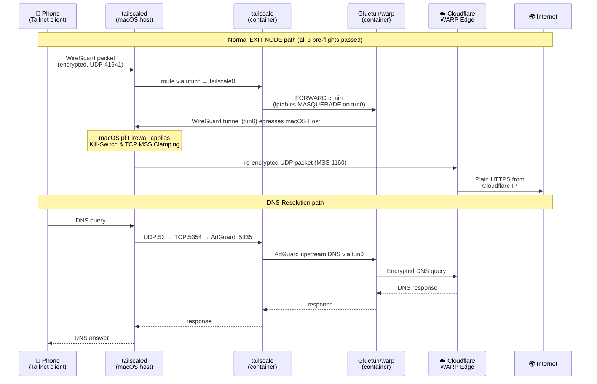
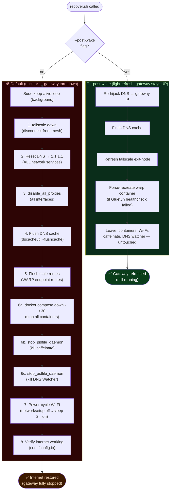
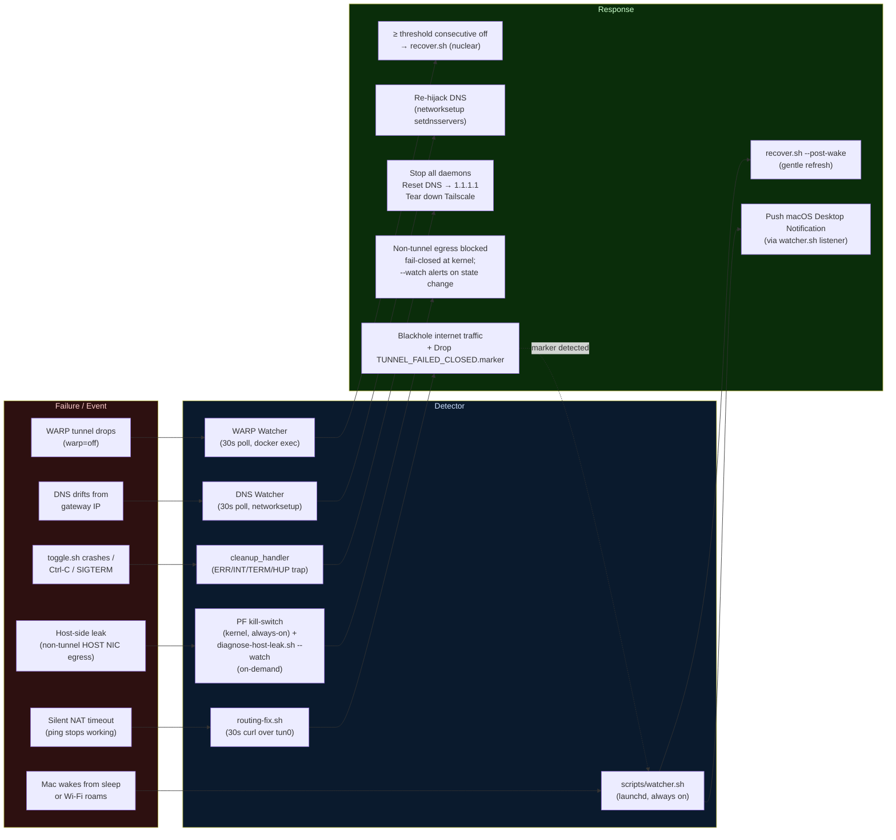

# nullexit — Flow Diagrams & Architecture

---

## 1. System Architecture — What's Running & Where



---

## 2. toggle.sh — Full START Flow

```mermaid
flowchart TD
    START(["./toggle.sh"])
    CHECK{"is_gateway_active?\n(containers running OR\nDNS ≠ 1.1.1.1)"}

    START --> CHECK
    CHECK -->|"YES → already ON"| STOPFLOW["→ See STOP Flow"]
    CHECK -->|"NO → start it"| S1

    S1["1. Reset DNS → 1.1.1.1\n(prevent deadlocks)"]
    S2["2. tailscale down\n(prevent exit-node routing during boot)"]
    S3["3. Check Colima VM\n(colima start --memory 0.6 --vm-type vz --network-address --network-mode bridged)"]
    S4["4. Configure VM swap\n(400MB, prevent OOM)"]
    S5["5. Clean corrupted AdGuard config\n(prevent container crash loop)"]
    S6["6. docker compose up -d --build\n(compile Go threat rules & boot containers)"]
    S7["7. Poll tailscale status\n(wait for 'offers exit node'\nup to 60s)"]
    TSREADY{"container\nTailscale ready?"}
    ABORT(["❌ ABORT\n→ cleanup_handler"])
    S8["8. Resolve gateway Tailscale IP\n(.gateway_ip or docker exec)"]
    S9["9. Verify tailscaled running\n(auto-start if needed)"]
    S10["10. tailscale up --reset\n--exit-node=\n--accept-routes=true\n--ssh=true --accept-dns=false"]

    PF1{"Pre-flight 1/3\ntailscale ping gateway"}
    PF2{"Pre-flight 2/3\ndig +tcp AdGuard DNS"}
    PF3{"Pre-flight 3/3\nWARP internet check"}
    ALLPASS{"All 3 pass?"}

    EXITPATH["✅ EXIT NODE PATH\n• tailscale up --exit-node=\n• force_dns_to_gateway (3× retry)\n• SOCKS5 disabled"]
    SOCKSPATH["⚠️ SOCKS5 FALLBACK PATH\n• macOS SOCKS5 → 127.0.0.1:1080\n• DNS proxy → 127.0.0.1:53\n• No exit node (SKIP_EXIT_NODE=true)"]

    DAEMONS["Start background daemons\n• caffeinate -i (sleep prevention)\n• DNS Watcher\n• WARP Watcher\n(all write → output.log)"]

    RULECOMPILE["Rule compiler status\n(log rule/IP counts)"]
    WRITEMARKER["write_gateway_active_marker\n(/tmp/nullexit-gateway-active.marker)"]
    DONE(["✅ Gateway UP"])

    S1 --> S2 --> S3 --> S4 --> S5 --> S6 --> S7
    S7 --> TSREADY
    TSREADY -->|"NO (40× NoState)"| ABORT
    TSREADY -->|"YES"| S8
    S8 --> S9 --> S10
    S10 --> PF1 --> PF2 --> PF3
    PF1 & PF2 & PF3 --> ALLPASS
    ALLPASS -->|"YES"| EXITPATH
    ALLPASS -->|"NO"| SOCKSPATH
    EXITPATH --> DAEMONS
    SOCKSPATH --> DAEMONS
    DAEMONS --> RULECOMPILE --> WRITEMARKER --> DONE

    style ABORT fill:#5c1010,color:#fff
    style EXITPATH fill:#0a3d1a,color:#c0ffc0
    style SOCKSPATH fill:#3d2d00,color:#ffe0a0
    style DAEMONS fill:#0a1f3d,color:#c0d8ff
    style DONE fill:#0a3d1a,color:#fff
```



---

## 3. toggle.sh — STOP Flow



---

## 4. Monitoring Layer — The 3 Background Daemons

```mermaid
graph LR
    subgraph DAEMONS["Background Daemons (all start with gateway, stop on teardown)"]
        direction TB

        subgraph D1["☕ Sleep Prevention"]
            CAFF["caffeinate -i\nPID: /tmp/nullexit-caffeinate.pid\n\nKeeps Mac awake while\ngateway is active"]
        end

        subgraph D2["🔁 DNS Watcher"]
            DNSW["Polls networksetup every ~30s\nPID: /tmp/nullexit-dns-watcher.pid\n\nIf DNS drifts from gateway IP\n→ re-hijacks automatically\n→ output.log"]
        end

        subgraph D3["🔭 WARP Watcher"]
            WARPW["Polls every 30s via:\ndocker compose exec warp wget cdn-cgi/trace\nPID: /tmp/nullexit-warp-watcher.pid\n\nCounts consecutive warp=off\n≥ WARP_FAIL_THRESHOLD (default 6=30s)\n→ runs recover.sh (nuclear)\n→ output.log"]
        end

    end

    subgraph BLIND["What each monitor can/can't see"]
        B1["WARP Watcher sees:\n✅ Container WARP tunnel state\n❌ Host NIC traffic\n❌ Flash leaks < 5s"]
        B2["Host-NIC blind spot covered by:\n🔒 PF kill-switch (kernel, fail-closed)\n🔍 on-demand: diagnose-host-leak.sh\n(--watch to monitor) / sweep.sh"]
    end

    D3 -.->|"covers"| B1
    B1 -.->|"gap closed by"| B2

    style D1 fill:#1a2d0a
    style D2 fill:#0a1a2d
    style D3 fill:#2d0a2d
    style BLIND fill:#1a1a1a,color:#aaa
```



---

## 5. Traffic Flow — Data Path (Normal Operation)



---

## 6. recover.sh — Decision Tree



---

## 7. Failure Paths & Self-Healing



---

## 8. output.log — Who Writes What

All events converge into a single `output.log` at the repo root.

| Writer | Event Types | Format |
|--------|-------------|--------|
| `toggle.sh` | All startup/shutdown steps, errors, pre-flight results | Plain text with timestamps |
| `recover.sh` | Every recovery step (nuclear or post-wake) | Plain text |
| **WARP Watcher** | `WARP DOWN`, `WARP RECOVERED`, `WARP SHUTDOWN` | `[UTC timestamp]` prefix |
| **DNS Watcher** | DNS re-hijack events | Appended inline |
| `docker compose` | Container logs on failure (last 100 lines of warp) | Dumped on ERR path |
| `routing-fix.sh` | (via `nullexit-logger` inside container) | Structured |

**Grep cheatsheet:**
```bash
grep 'WARP DOWN' output.log    # Container-side tunnel drops
grep 'WARP SHUTDOWN' output.log # Auto-recovery triggered
grep 'WARP RECOVERED' output.log # Self-healed before threshold
grep -E 'EXEC:|EXIT ' output.log # Lifecycle breadcrumbs (last command + exit)
```
